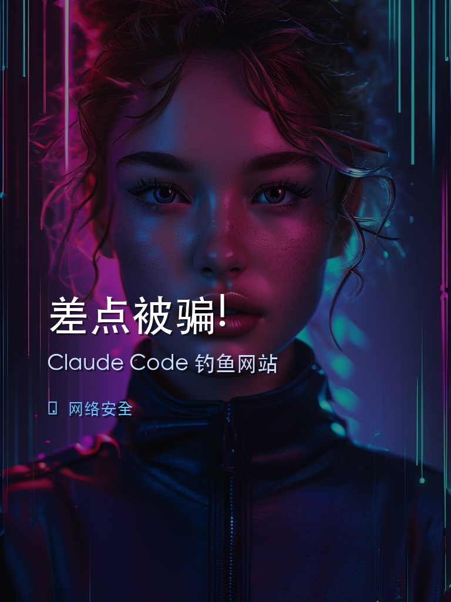
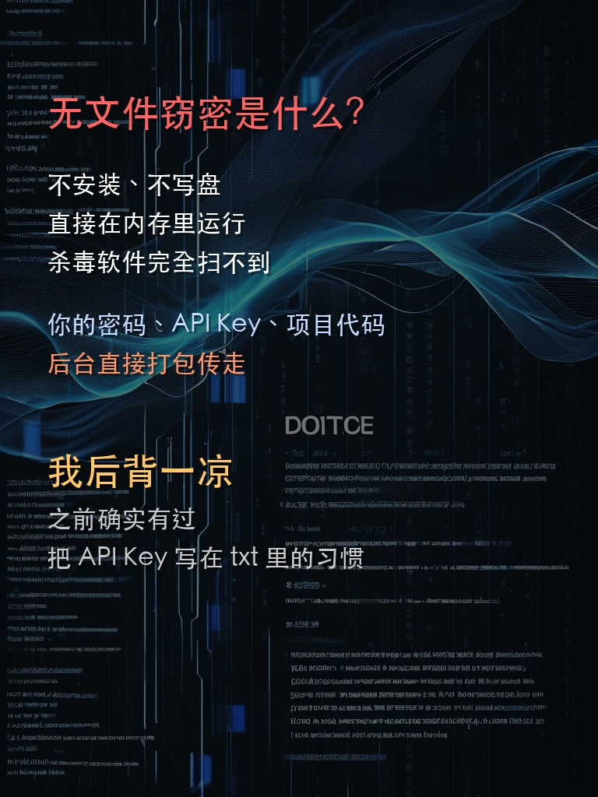
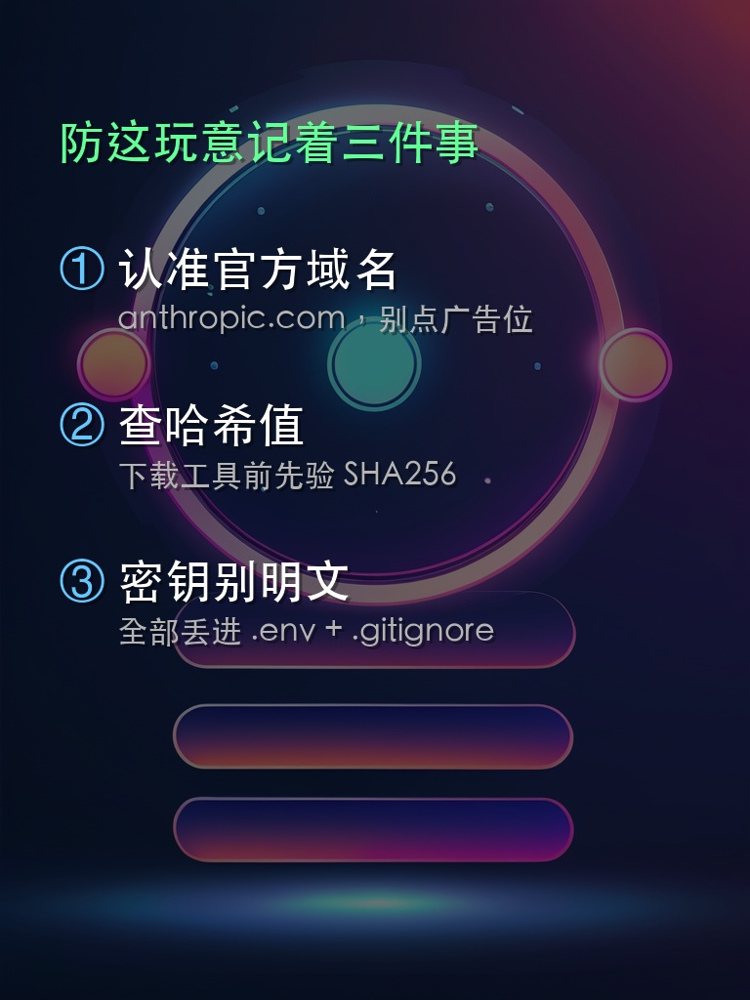

# 捉刀人-书童 | XHS-ShuTong

> 🤖 AI 驱动的小红书全自动内容流水线 — 从选题到发布，一条龙搞定


---

## ✨ 这是什么？

**捉刀人-书童**是一套 AI 驱动的小红书内容自动化系统。每天自动抓取热点、生成拟人化文案、AI 生成配图、自动发布到小红书——全程无需人工干预。

### 🎯 核心能力

| 能力 | 说明 |
|------|------|
| 🔍 **智能选题** | 自动抓取多源 Feed，AI 过滤筛选当日热点 |
| ✍️ **拟人化文案** | AI 生成「像真人发的帖子」风格内容，不像 AI 生成的 |
| 🎨 **AI 配图** | 三平台生图（硅基流动/即梦/可灵），自动轮换 |
| 📱 **自动发布** | CDP 浏览器自动化，填标题、传图片、发布 |
| 📊 **数据追踪** | 发布记录归档、存活率追踪、效果复盘 |
| 🧹 **自动清理** | 发布后自动归档+清理，防止历史残留 |

---

## 📸 效果展示

### AI 生图卡片效果

| 封面图 | 知识卡 | 方法卡 |
|--------|--------|--------|
|  |  |  |

### 拟人化文案风格

```
❌ 传统 AI 风：
"您是否考虑过，您打开的网站可能是仿冒的？请注意网络安全。"

✅ 书童拟人风：
"说实话，我今天差点中招。
事情是这样的：我在搜Claude Code的安装包，搜索结果第一个就是个'Anthropic官网'，
页面做得一模一样...我后背一凉——因为我之前确实有过把API Key写在txt里的习惯。"
```

**拟人风特点**：
- 第一人称叙事，像在讲自己的经历
- 口语化表达：「说真的」「离谱」「你品品」
- 长短句混搭，有情绪起伏
- 禁止自问自答、三段式列表、官方用语

---

## 🚀 快速开始

### 环境要求

- Python 3.11+
- Chrome 浏览器（需开启远程调试端口）
- 小红书账号（需扫码登录一次）

### 安装

```bash
git clone https://github.com/yourname/XHS-ShuTong.git
cd XHS-ShuTong
pip install -r requirements.txt
```

### 配置

```bash
# 1. AI 生图 API Key（至少配一个）
echo "SILICONFLOW_API_KEY=your_key" > .env.siliconflow  # 推荐，免费100张/月

# 2. Chrome 远程调试
# 启动 Chrome 时加参数：
/Applications/Google\ Chrome.app/Contents/MacOS/Google\ Chrome \
  --remote-debugging-port=9222

# 3. 登录小红书
python cdp_publish.py login
# 扫码登录后 Cookie 自动保存
```

### 使用

```bash
# 一键发布（完整流水线）
python publish_pipeline.py

# 或分步执行
python xhs_feed_fetcher.py          # 1. 抓取 Feed
python xhs_content_filter.py        # 2. 内容过滤
python ai_image_gen.py --prompt "描述" --save bg.jpg  # 3. AI 生图
python xhs_cards.py --type cover    # 4. 生成卡片
python cdp_publish.py fill --title "标题" --content "正文" --images *.jpg  # 5. 填充
python xhs_archive_cleanup.py       # 6. 归档清理
```

---

## 📁 项目结构

```
XHS-ShuTong/
├── ai_image_gen.py           # AI 生图（硅基/即梦/可灵）
├── xhs_cards.py              # 知识卡片生成
├── xhs_feed_fetcher.py       # Feed 热点抓取
├── xhs_content_filter.py     # 内容过滤筛选
├── xhs_archive_cleanup.py    # 发布归档+清理
├── cdp_publish.py            # CDP 浏览器自动化发布
├── publish_pipeline.py       # 完整流水线编排
├── xhs_templates.json        # 卡片模板配置
├── docs/
│   ├── xhs-content-architecture.md  # 内容架构
│   ├── xhs-daily-rules.md          # 每日规则
│   └── xhs-style-guide.md          # 写作风格指南
└── examples/                 # 效果示例
```

---

## 🧪 测试记录

| 时间 | 里程碑 | 状态 |
|------|--------|------|
| 2026-05-25 | 系统搭建，Pillow 卡片初版 | ✅ |
| 2026-05-27 | 首次自动发布成功 | ✅ |
| 2026-05-30 | 流水线恢复，发布「API中转站」 | ✅ |
| 2026-06-01 | **AI 生图升级**，拟人化文案，3 卡片精简版 | ✅ |
| 2026-06-01 | 硅基流动/即梦双平台测试通过 | ✅ |

### 最佳效果

- **内容质量**：拟人化文案，读起来像真人分享经历
- **图片质量**：AI 生成背景 + 文字叠层，告别纯色块
- **发布效率**：全自动流水线，每天 07:45 定时执行
- **稳定性**：三平台 API 轮换，单平台挂了自动切

---

## ⚠️ 风险提示

**使用本项目进行小红书自动化，存在被平台风控、限流、封号的风险。**

- 建议先在测试号上验证
- 控制发布频率（建议每天 1-2 篇）
- 发布内容需人工复核
- 使用者需自行承担账号风险

---

## 📄 License

MIT
